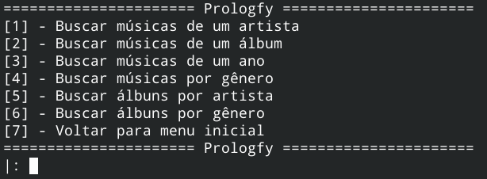

# Prologfy

**Disciplina**: FGA0210 - PARADIGMAS DE PROGRAMAÇÃO - T01  
**Nro do Grupo**: 01 
**Paradigma**: Lógico 

## Alunos
|Matrícula | Aluno |
| -- | -- |
| 15/0009011  |  Elias Bernardo |
| 19/0106565  |  Fernando Miranda Calil |
| 15/0008228  |  Daniel Marques Rangel |
| 16/0132550  |  Lorrany dos Santos Azevedo |

## Sobre

O prologfy é um projeto implementado na linguagem prolog que faz recomendações de músicas e albúns. Além disso também é possível buscar por artistas de um determinado genêro, buscar musícas por ano, inserir ou remover álbuns e músicas da nossa base de dados, e salvar esses dados de forma consistente em um arquivo csv.

## Screenshots

## Instalação 

**Linguagens**: Prolog 

Plataforma SWI-Prolog ou algum outro compilador prolog ou Docker.

### Para rodar com docker:

Após instalar o docker, execute o comando

    $ (sudo) make build-run

Esse comando irá buildar e executar o container, montando um volume que ficará responsável por atualizar o csv.

### Sem docker:

Você também pode rodar o projeto sem docker, caso tenha o swi-prolog instalado. Para isso apenas execute o projeto com

    $ swipl main.pl

E rode o projeto de acordo com as instruções de uso.

## Uso 

Para utilizar o prologfy é necessário que o usuário ou tenha um compilador prolog, ou tenha o docker instalado em seu computador. 
Caso o usuário opte pelo compilador recomendamos o SWI-Prolog, o seu download pode ser feito através do seguinte link:
[SWI-Prolog](https://www.swi-prolog.org/Download.html)

Após instalação do compilador caso o usuário esteja no linux basta abrir o terminal, clonar o repositório e executar os seguintes comandos:
    
    $ cd 2020.2_G1_Logico_Prologfy
    
    $ swipl
    
    ? [main].
    
    ? main.

E navegar pelas opções de menu da aplicação.

Agora caso o usuário opte pela execução via Docker, basta clonar o repositório e executar os comandos:
    
    $ cd 2020.2_G1_Logico_Prologfy
    
    $ sudo make build-run
    
    ? main.
    
E navegar pelas opções de menu da aplicação.

## Vídeo

O vídeo se encontra na pasta `assets/video.mp4`.

## Outros 

Os arquivos .csv que estao na pasta db/ funcionam como banco de dados persistente da aplicação. Ao executar o projeto pela primeira vez, eles serão carregados em memória, inserindo os funtores automaticamente. Da mesma forma, ao finalizar a execução do projeto pelo menu, os arquivos csv serão atualizados automaticamente de acordo com as alterações realizadas durante o uso do Prologfy.

## Fontes

Caso utilize materiais de terceiros, referencie-os adequadamente.
